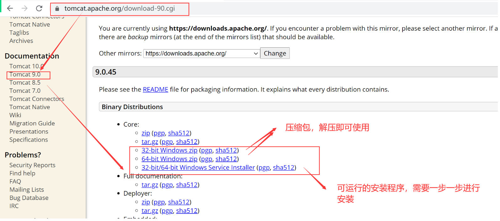

# Tomcat

## 基础概念

### Java Web服务器

基于Java的Web服务器，该服务器上可以访问java程序

### Java 应用

基于java编写的项目或者工程或者程序

### Servlet 接口

中介者：servlet接口

### Servlet 容器

这个服务器能够运行servlet, Java web 服务器等价于 Servlet 容器

### Servlet 命名

server 服务器

applet  小型的服务程序

### Servlet规范

servlet 接口：定义接口，也就是定义一种规范。

servlet接口是由oracle定义。

https://docs.oracle.com/javaee/7/tutorial/servlets.htm

## tomcat 安装运行卸载

**官网**

> https://tomcat.apache.org/download-90.cgi

### **准备工作**

1  注意jdk 版本和tomcat的版本匹配

2  配置jdk环境变量

###  通过exe 格式文件

课后自己完成

###  通过zip格式文件

课堂上演示

